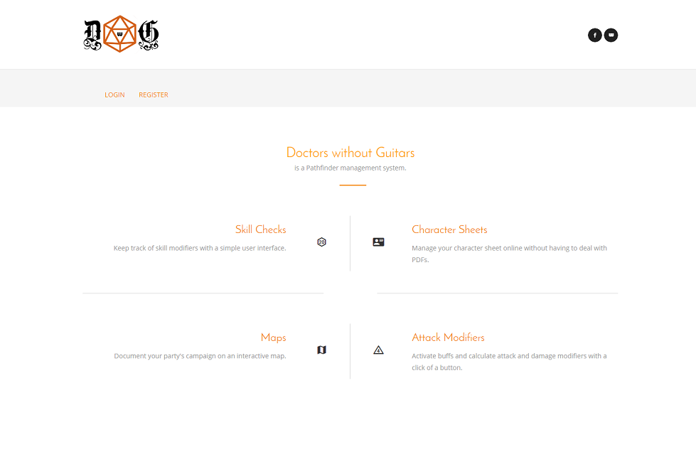

# doctors-without-guitars
A Pathfinder management application.

[Doctors without Guitars (DEV)](https://doctors-without-guitars-dev.herokuapp.com/)


# Intro
Demonstrates knowledge of:


- Java
- Spring Boot
- Spring-JPA (with MySQL)
- API.AI
- OpenLayers 3 (Map API)
- iText (PDF API)
- Stormpath (User Authentication)
- Web APIs (HTTP)
- Test-Driven Development (JUnit 4 and Mockito)
- Automated UI Testing (Selenium)
- HTML5 and CSS3 / Twitter Bootstrap
- Heroku (Platform as a Service)

# Dev Notes
Set Stormpath API Keys as System Variables:
```
STORMPATH_APPLICATION_HREF
STORMPATH_CLIENT_APIKEY_ID
STORMPATH_CLIENT_APIKEY_SECRET
```


Add a datasource.properties file under src/main/resource/properties:
```
mysql.url=jdbc:mysql://host:3306/databasename
mysql.username=username
mysql.password=password
```


Add an apiai.properties file under src/main/resource/properties:
```
api.ai.apikey=abcdefg123456
```
